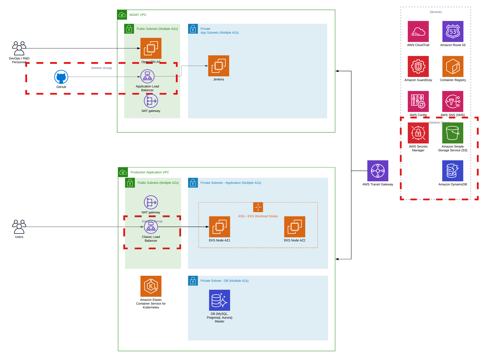

# ALPHA
## CI/CD Infrastructure Provisioning with Terraform on AWS
### Project Architectural Diagram

We are going to use Terraform to provision the resources in the the Architectural Diagram; a CI/CD infrastructure on AWS Cloud for a fictional company called **Alpha**. 

The resources to be provisioned as found in the HLD (Architectural Diagram) includes: 

- 2 VPCs; 1 for management (Management VPC) and 1 dedicated to running the application (Application VPC) 

- A transit gateway to allow peering of the 2 VPCs enabling communication between hosts within the VPCs. 

- Multiple public and private subnets in each VPC with each zone having 1 public subnet and 1 private subnet. 

- NAT gateways for hosts within private subnets to provide public network access. 

- Jenkins server in a private subnet in the Management VPC to automate the build, test, and deployment of application code changes on GitHub or similar. 

- An OpenVPN server to allow secure access for DevOps/ R&D personnel to hosts within private subnets specifically the Jenkins server. 

- Amazon Elastic Kubernetes Service (EKS) cluster with EC2 capacity provider auto-scaling group nodes in a private subnet of the Application VPC. 

- An application load balancer in a public subnet of the Application VPC to forward external user traffic to the application/workloads running on the EKS cluster. 

- A Postgres RDS database in a private subnet of the Application VPC. 

- An AWS CloudTrail for security and audit in the AWS account. 

- Amazon Route53 for DNS 

- Amazon GuardDuty for threat detection in the accounts VPCs. 

- Amazon ECR for container image storage and access 

- AWS Config for AWS resources configuration management 

- AWS SNS for event notification 

- Amazon S3 buckets for AWS config, AWS CloudTrail, and remote state management. 

- A DynamoDB table for remote state management and state locking. 

- An application load balancer for the Jenkins server. It forwards traffic from GitHub to the Jenkins server enabling the webhook capability. 
 

#### About the Terraform Configuration 

##### Remote State Management:  

- We utilized [Amazon S3 Bucket](./data-stores/terraform-state/tf-state-bucket.tf) as our backend to store the Terraform state file which contains details about the infrastructure being provision & managed with Terraform. 

- The S3 bucket is versioned to prevent accidental deletion. 

- Public access to the bucket is restricted/blocked. 

- [DynamoDB table](./data-stores/terraform-state/tf-state-dynamodb.tf) is also used to lock the state to prevent state corruption or race conditions. 

- Remote state management enhances collaboration and Amazon S3 provides durable storage. 

 

##### Modules & Code Re-usability: 

- Wrote [custom modules](./modules/) to enhance code re-usability. 

- Utilized modules from TF registry to speed up development. 

 

##### Secrets Management: 

- To avoid disclosing secrets and sensitive information in the Terraform configuration, we utilized AWS Secrets Manager. We had the secrets stored in AWS Secrets Manager and then queried them using the Terraform [data](./data.tf) resource block. 
 

### Provisioning the Infrastructure: 

- To provision the infrastructure and all its resources, run the [tf-provision.sh](./tf-provision.sh) script. The script will first provision the EKS cluster and its dependent resources such as the Application VPC before the remaining resources in the Terraform configuration. 